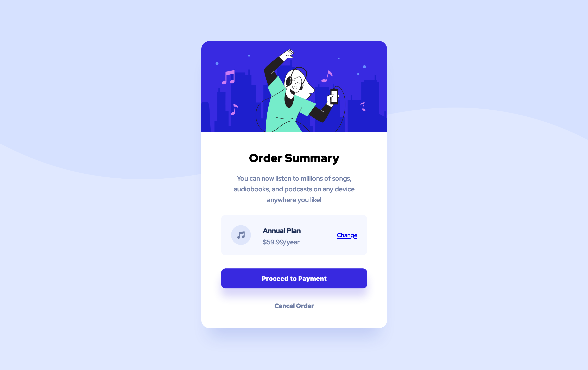

# Frontend Mentor - Order summary component solution

This is a solution to the [Order summary card challenge on Frontend Mentor](https://www.frontendmentor.io/challenges/order-summary-component-QlPmajDUj). Frontend Mentor challenges help you improve your coding skills by building realistic projects.  

## Table of contents

- [Overview](#overview)
  - [The challenge](#the-challenge)
  - [Screenshot](#screenshot)
  - [Links](#links)
- [My process](#my-process)
  - [Built with](#built-with)
  - [What I learned](#what-i-learned)
- [Author](#author)

## Overview

### The challenge

Users should be able to:

- View the optimal layout depending on their device's screen size
- See hover states for interactive elements

### Screenshot

### Links

- Solution URL: [https://www.frontendmentor.io/solutions/order-summary-component-with-sass-and-flexbox-0j6di7Gy0](https://www.frontendmentor.io/solutions/order-summary-component-with-sass-and-flexbox-0j6di7Gy0)
- Live Site URL: [https://madmanden.github.io/order-summary-component/](https://madmanden.github.io/order-summary-component/)

## My process

### Built with

- Flexbox
- [SASS](https://sass-lang.com)
- GitHub Pages

### What I learned

I expanded my knowledge of Flexbox and media queries in this challenge.

## Author

- GitHub - [Madmanden](https://github.com/Madmanden)
- Website - [Christian Holm](https://www.christianholm.dev)
- Frontend Mentor - [@Madmanden](https://www.frontendmentor.io/profile/Madmanden)